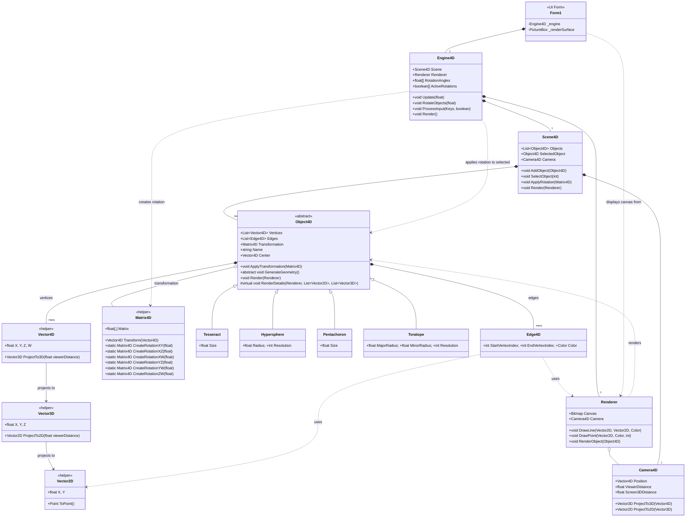

# 4D Object Renderer

A C# Windows Forms application for visualizing four-dimensional (4D) geometric objects by projecting them into 3D space and then onto a 2D screen.

## How it Works

The application renders 4D objects using a projection pipeline:

1.  **4D Coordinates:** Objects are defined by vertices in 4D space (X, Y, Z, W).
2.  **4D to 3D Projection:** A perspective projection is used to transform the 4D coordinates into 3D space. This is analogous to how a 3D scene is projected onto a 2D camera sensor, but with an extra dimension. The distance of the viewpoint along the W-axis affects the perspective.
3.  **3D to 2D Projection:** The resulting 3D coordinates are then projected onto a 2D plane using standard perspective projection, similar to typical 3D graphics rendering.
4.  **Rendering:** The final 2D points are used to draw the wireframe edges of the object on the screen.

## Features

* Visualize various 4D objects (Tesseract, Hypersphere, Pentachoron, Toratope).
* Wireframe rendering with color-coded edges often indicating axes or structure.
* Interactive rotation of objects across the 6 distinct planes in 4D (XY, XZ, XW, YZ, YW, ZW).
* Camera controls to move the viewpoint in 4D space.
* Ability to switch between different objects in the scene.

## Architecture

## Object Previews

**Tesseract (Hypercube)**

**Hypersphere (3-Sphere)**

**Pentachoron (5-Cell)**

**Toratope (4D Torus)**

## Controls

* **1-6 Keys**: Toggle rotation in specific 4D planes (1:XY, 2:XZ, 3:XW, 4:YZ, 5:YW, 6:ZW).
* **Space**: Pause/resume animation.
* **Tab**: Switch selected object.
* **W/S**: Move camera along Y-axis.
* **A/D**: Move camera along X-axis.
* **Q/E**: Move camera along Z-axis.
* **R/F**: Move camera along W-axis.
* **+/- (or OemPlus/OemMinus)**: Adjust 4D->3D viewer distance.
* **Up/Down Arrows**: Increase/decrease rotation speed.
* **T**: Toggle rotation mode (Reset Each Frame / Cumulative).

## Requirements

* .NET 8.0 (or compatible).
* Windows Operating System (uses Windows Forms).

## How to Run

1.  Clone the repository.
2.  Open the solution file (`.sln`) in Visual Studio or use the .NET CLI.
3.  Build the solution (`dotnet build`).
4.  Run the application (`dotnet run --project FourDRenderer/FourDRenderer.csproj`).
