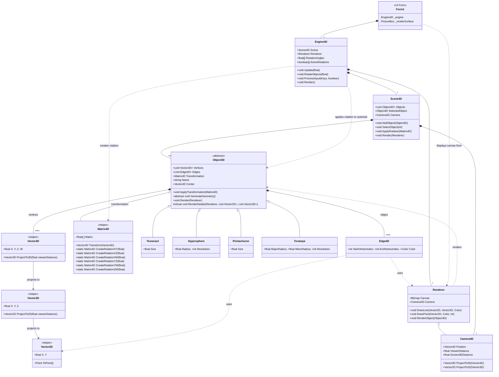

# 4D Object Renderer
## Video
https://youtu.be/mvJnPCmKaUM

A C# Windows Forms application for visualizing four-dimensional (4D) geometric objects using a natively 4D engine space with advanced camera controls.

## How it Works

The application renders 4D objects using a native 4D projection pipeline:

1.  **4D Coordinates:** Objects are defined by vertices in 4D space (X, Y, Z, W).
2.  **4D Camera Space:** The camera exists in 4D space with position and orientation, creating a 4D view matrix that transforms world coordinates to camera space.
3.  **4D to 3D Projection:** The camera projects 4D coordinates to 3D space using perspective projection along the W-axis in camera space.
4.  **3D to 2D Projection:** The resulting 3D coordinates are then projected onto a 2D plane using standard perspective projection.
5.  **Rendering:** The final 2D points are used to draw the wireframe edges of the object on the screen.

## Features

* Visualize various 4D objects (Tesseract, Hypersphere, Pentachoron, Toratope).
* Wireframe rendering with color-coded edges often indicating axes or structure.
* Interactive rotation of objects across the 6 distinct planes in 4D (XY, XZ, XW, YZ, YW, ZW).
* **NEW:** 4D camera controls with position and orientation in 4D space.
* **NEW:** Camera rotation controls across all 6 4D planes.
* **NEW:** Multiple 4D projection methods (Perspective, Orthographic, Stereographic, Fisheye).
* **NEW:** Comparison mode showing all 4 projection methods side by side.
* Ability to switch between different objects in the scene.
* **NEW:** Native 4D engine space with camera perceiving 4D objects directly.

## Architecture

```mermaid
classDiagram
    %% Mathematics Framework
    class Vector2D {
        +float X, Y
        +Point ToPoint()
        <<helper>>
    }
    class Vector3D {
        +float X, Y, Z
        +Vector2D ProjectTo2D(float viewerDistance)
        <<helper>>
    }
    class Vector4D {
        +float X, Y, Z, W
        +Vector3D ProjectTo3D(float viewerDistance)
        <<helper>>
    }
    class Matrix4D {
        +float[,] Matrix
        +Vector4D Transform(Vector4D)
        +static Matrix4D CreateRotationXY(float)
        +static Matrix4D CreateRotationXZ(float)
        +static Matrix4D CreateRotationXW(float)
        +static Matrix4D CreateRotationYZ(float)
        +static Matrix4D CreateRotationYW(float)
        +static Matrix4D CreateRotationZW(float)
        <<helper>>
    }

    %% 4D Objects
    class Object4D {
        <<abstract>>
        +List~Vector4D~ Vertices
        +List~Edge4D~ Edges
        +Matrix4D Transformation
        +string Name
        +Vector4D Center
        +void ApplyTransformation(Matrix4D)
        +abstract void GenerateGeometry()
        +void Render(Renderer)
        #virtual void RenderDetails(Renderer, List~Vector2D~, List~Vector3D~)
    }
    class Tesseract { +float Size }
    class Hypersphere { +float Radius; +int Resolution }
    class Pentachoron { +float Size }
    class Toratope { +float MajorRadius; +float MinorRadius; +int Resolution }
    class Edge4D { +int StartVertexIndex; +int EndVertexIndex; +Color Color }

    %% Rendering System
    class Camera4D {
        +Vector4D Position
        +float ViewerDistance
        +float Screen3DDistance
        +Vector3D ProjectTo3D(Vector4D)
        +Vector2D ProjectTo2D(Vector3D)
    }
    class Renderer {
        +Bitmap Canvas
        +Camera4D Camera
        +void DrawLine(Vector2D, Vector2D, Color)
        +void DrawPoint(Vector2D, Color, int)
        +void RenderObject(Object4D)
    }

    %% Scene Management
    class Scene4D {
        +List~Object4D~ Objects
        +Object4D SelectedObject
        +Camera4D Camera
        +void AddObject(Object4D)
        +void SelectObject(int)
        +void ApplyRotation(Matrix4D)
        +void Render(Renderer)
    }
    class Engine4D {
        +Scene4D Scene
        +Renderer Renderer
        +float[] RotationAngles
        +boolean[] ActiveRotations
        +void Update(float)
        +void RotateObjects(float)
        +void ProcessInput(Keys, boolean)
        +void Render()
    }

    %% UI
    class Form1 {
      -Engine4D _engine
      -PictureBox _renderSurface
      <<UI Form>>
    }

    %% Relationships
    Vector4D --> Vector3D : projects to
    Vector3D --> Vector2D : projects to

    Object4D <|-- Tesseract
    Object4D <|-- Hypersphere
    Object4D <|-- Pentachoron
    Object4D <|-- Toratope

    Object4D *-- "many" Vector4D : vertices
    Object4D *-- "many" Edge4D : edges
    Object4D o-- Matrix4D : transformation

    Edge4D ..> Renderer : uses
    Edge4D ..> Vector2D : uses

    Renderer o-- Camera4D
    Renderer ..> Object4D : renders

    Scene4D *-- "many" Object4D
    Scene4D *-- "1" Camera4D

    Engine4D *-- "1" Scene4D
    Engine4D *-- "1" Renderer
    Engine4D ..> Object4D : applies rotation to selected
    Engine4D ..> Matrix4D : creates rotation

    Form1 *-- "1" Engine4D
    Form1 ..> Renderer : displays canvas from
```

## Object Previews

**Tesseract (Hypercube)**

**Hypersphere (3-Sphere)**

**Pentachoron (5-Cell)**

**Toratope (4D Torus)**

## Controls

* **1-6 Keys**: Toggle object rotation in specific 4D planes (1:XY, 2:XZ, 3:XW, 4:YZ, 5:YW, 6:ZW).
* **I/J/K/L/U/O Keys**: Toggle camera rotation in specific 4D planes (I:XY, J:XZ, K:XW, L:YZ, U:YW, O:ZW).
* **P Key**: Cycle through projection methods (Perspective → Orthographic → Stereographic → Fisheye).
* **C Key**: Toggle comparison mode (shows all 4 projection methods side by side).
* **Space**: Pause/resume object and camera animation.
* **Tab**: Switch selected object.
* **Backspace**: Reset entire simulation (objects, camera, toggles, speeds).
* **+/- (or OemPlus/OemMinus)**: Adjust 4D->3D viewer distance.
* **Up/Down Arrows**: Increase/decrease rotation speed.
* **T**: Toggle rotation mode (Reset Each Frame / Cumulative).

## Requirements

* .NET 8.0 (or compatible).
* Windows Operating System (uses Windows Forms).

## How to Run

1.  Clone the repository.
2.  Open the solution file (`.sln`) in Visual Studio or use the .NET CLI.
3.  Build the solution (`dotnet build`).
4.  Run the application (`dotnet run --project FourDRenderer/FourDRenderer.csproj`).
